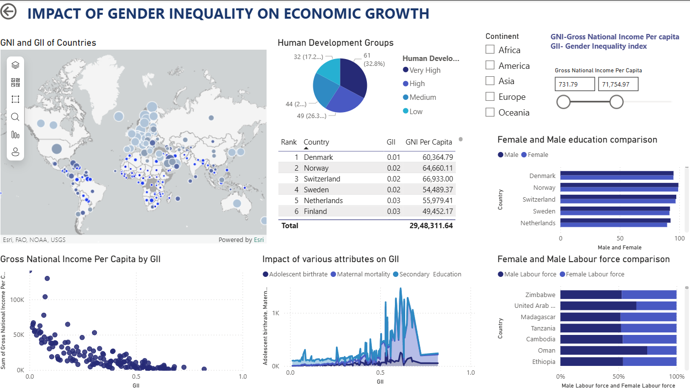

# Gender Equality & Economic Growth

A data-driven research project analyzing the impact of gender equality on economic growth using **statistics, Python, and Power BI**. The study explores correlations between gender parity indicators and GDP growth, providing insights into how inclusivity drives sustainable development.

## 🔑 Key Features

* 📊 Data Cleaning & Preprocessing in **Python (Pandas, NumPy)**
* 📈 Exploratory Data Analysis using **Seaborn, Matplotlib**
* 🤖 Applied **Regression Models** to study relationships
* 🌍 Interactive **Power BI Dashboard with Map Visualization** for country-level insights

## 📂 Project Structure

* `data/` → Raw and cleaned datasets
* `notebooks/` → Jupyter notebooks for analysis
* `powerbi/` → Power BI dashboard file (`.pbix`)
* `results/` → Graphs, statistical results, and final reports

## 📸 Dashboard Preview

## 📌 Results & Insights

* 📉 **Gender Inequality Index (GII) & Growth**: Strong negative correlation — higher inequality is linked with lower Gross National Income (GNI) per capita.
* 🏥 **Maternal Mortality**: Inversely related to growth. Countries with high maternal mortality tend to have lower GNI and HDI. Reducing maternal mortality improves development.
* 👶 **Adolescent Birth Rate**: Higher rates impose an economic burden by disrupting female education and labor force participation.
* 🎓 **Female Education**: Strong positive correlation with GNI and HDI. Investing in education enhances labor force participation and drives economic growth.
* 👩‍💼 **Female Labor Force Participation**: Higher participation is consistently associated with stronger economic performance. Policies promoting workforce equality boost productivity.

---

## 🔮 Future Work

* **Policy Impact Analysis**:

  * Case studies of countries with successful gender equality initiatives.
  * Policy simulations to measure economic impact of reforms.

* **Technological Integration**:

  * Real-time data collection via mobile/IoT for up-to-date monitoring of gender inequality indicators.

---

## ✅ Conclusion

Gender equality is not just a social issue but an **economic imperative**.
Reducing inequality, improving female education, increasing female labor participation, and addressing maternal mortality and adolescent birth rates can substantially enhance **national income and human development**.

---

